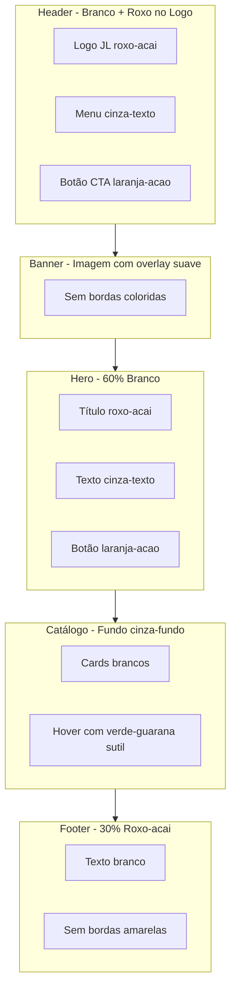

# Plano de Refatoração: Design Premium com Regra 60/30/10

## 📋 Resumo do Projeto

**Objetivo:** Transformar o visual atual do site JL Palácio dos Sabores de "saturado e brega" para "moderno, limpo e premium" (nível franquia de sucesso).

**Arquivos envolvidos:**
- `../../Jl palacio/style.css` - CSS principal (será refatorado)
- `../../Jl palacio/index.html` - HTML estrutural (ajustes mínimos se necessário)

---

## 🎨 Regra 60/30/10 Aplicada

```
┌─────────────────────────────────────────────────────────────┐
│                                                             │
│   60% - COR DOMINANTE (Neutros)                            │
│   ├── var(--branco): #ffffff                               │
│   └── var(--cinza-fundo): #f9fafb                          │
│                                                             │
│   Uso: Fundos de seções, hero, catálogo, cards             │
│                                                             │
├─────────────────────────────────────────────────────────────┤
│                                                             │
│   30% - COR SECUNDÁRIA (Identidade)                        │
│   └── var(--roxo-acai): #874BAB                            │
│                                                             │
│   Uso: Header, Footer, títulos principais, logo            │
│                                                             │
├─────────────────────────────────────────────────────────────┤
│                                                             │
│   10% - COR DE DESTAQUE (Ação)                             │
│   └── var(--laranja-acao): #FF7F11                         │
│                                                             │
│   Uso: Botões CTA, links hover, badges importantes         │
│                                                             │
├─────────────────────────────────────────────────────────────┤
│                                                             │
│   CORES SUTIS (Detalhes mínimos)                           │
│   ├── var(--verde-guarana): #6BBF59 → hover, ícones, selos │
│   └── var(--amarelo-sol): #FFFD4A → badges, destaques      │
│                                                             │
└─────────────────────────────────────────────────────────────┘
```

---

## 🔍 Análise do CSS Atual - Problemas Identificados

### Header (`.cabecalho`)
| Problema | Solução |
|----------|---------|
| `border-bottom: 4px solid var(--amarelo-sol)` | Remover ou reduzir para 2px com cor neutra |
| Borda amarela muito chamativa | Usar sombra sutil no lugar |

### Banner Section (`.banner-section`)
| Problema | Solução |
|----------|---------|
| `background: var(--roxo-acai)` | Manter, mas com opacidade ou overlay |
| `border-bottom: 4px solid var(--verde-guarana)` | Remover completamente |

### Hero Section (`.hero-section`)
| Problema | Solução |
|----------|---------|
| `padding: 64px 20px` | Aumentar para 80px-100px vertical |
| Fundo branco OK | Manter |

### Botão Catálogo (`.btn-catalogo`)
| Problema | Solução |
|----------|---------|
| `background: var(--amarelo-sol)` | Trocar para `var(--laranja-acao)` |
| Amarelo muito vibrante para CTA | Laranja é mais premium e converte melhor |

### Footer (`.rodape`)
| Problema | Solução |
|----------|---------|
| `border-top: 4px solid var(--amarelo-sol)` | Remover ou usar linha fina neutra |
| Borda amarela quebra elegância | Manter roxo-acai limpo |

### Cards de Produtos (`.card-produto`, `.card-icone-box`)
| Problema | Solução |
|----------|---------|
| `background: var(--roxo-acai)` no ícone | Trocar para fundo neutro claro |
| Muito roxo em área grande | Usar roxo apenas em hover ou bordas finas |

### Caixa Imagem Loja (`.caixa-imagem-loja`)
| Problema | Solução |
|----------|---------|
| `border: 4px solid var(--amarelo-sol)` | Remover ou usar borda cinza sutil |

---

## 📐 Melhorias de Espaçamento e Refinamento

### Border-Radius Modernos
```css
/* Atual → Novo */
border-radius: 12px  → border-radius: 16px   /* Cards */
border-radius: 16px  → border-radius: 20px   /* Cards grandes */
border-radius: 50px  → border-radius: 9999px /* Botões pill */
```

### Box-Shadows Premium
```css
/* Sombras mais suaves e elegantes */
--shadow-sm: 0 1px 2px rgba(0, 0, 0, 0.04);
--shadow-md: 0 4px 12px rgba(0, 0, 0, 0.06);
--shadow-lg: 0 12px 32px rgba(0, 0, 0, 0.08);
--shadow-hover: 0 20px 40px rgba(0, 0, 0, 0.12);
```

### Espaçamentos Generosos
```css
/* Seções principais */
padding: 80px 24px;  /* Mobile */
padding: 120px 40px; /* Desktop */

/* Entre elementos */
gap: 40px; /* Grids */
margin-bottom: 32px; /* Títulos */
```

---

## 🔄 Fluxo Visual do Design Premium



---

## ✅ Checklist de Alterações no style.css

### Variáveis `:root`
- [ ] Manter todas as cores originais (obrigatório)
- [ ] Adicionar variáveis de sombra premium
- [ ] Adicionar variáveis de espaçamento

### Header
- [ ] Remover `border-bottom: 4px solid var(--amarelo-sol)`
- [ ] Adicionar `box-shadow` mais elegante
- [ ] Aumentar padding vertical

### Banner Section
- [ ] Remover `border-bottom: 4px solid var(--verde-guarana)`
- [ ] Adicionar transição suave na imagem

### Hero Section
- [ ] Aumentar padding para 80px-120px
- [ ] Refinar tipografia do título
- [ ] Melhorar espaçamento do subtítulo

### Botões
- [ ] `.btn-catalogo`: trocar amarelo por laranja-acao
- [ ] `.btn-vendedor`: manter laranja-acao, refinar sombra
- [ ] Adicionar transições mais suaves

### Cards
- [ ] `.card-icone-box`: trocar roxo por fundo neutro
- [ ] `.card-produto`: melhorar sombras e hover
- [ ] `.card-logo`: remover borda roxa, usar hover sutil

### Footer
- [ ] Remover `border-top: 4px solid var(--amarelo-sol)`
- [ ] Aumentar padding
- [ ] Refinar tipografia

### Elementos Gerais
- [ ] Aumentar border-radius globalmente
- [ ] Aplicar sombras mais suaves
- [ ] Verde e amarelo apenas em `:hover` e detalhes

---

## 🎯 Resultado Esperado

**Antes:** Visual saturado com cores vibrantes competindo por atenção
**Depois:** Design limpo e premium onde:
- O branco/cinza domina criando respiro visual
- O roxo-acai aparece estrategicamente na identidade
- O laranja-acao guia o usuário para ações
- Verde e amarelo são "temperos" sutis

---

## 📁 Arquivos a Modificar

1. **`../../Jl palacio/style.css`** - Refatoração completa
2. **`../../Jl palacio/index.html`** - Possíveis ajustes de classes (se necessário)
